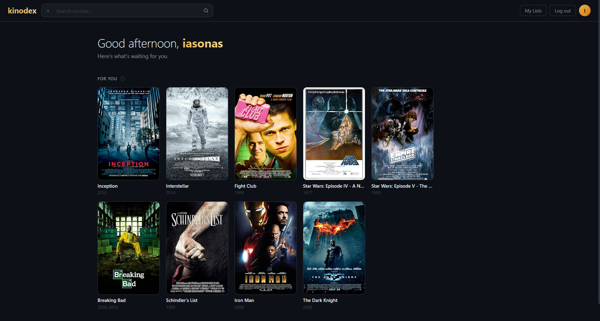
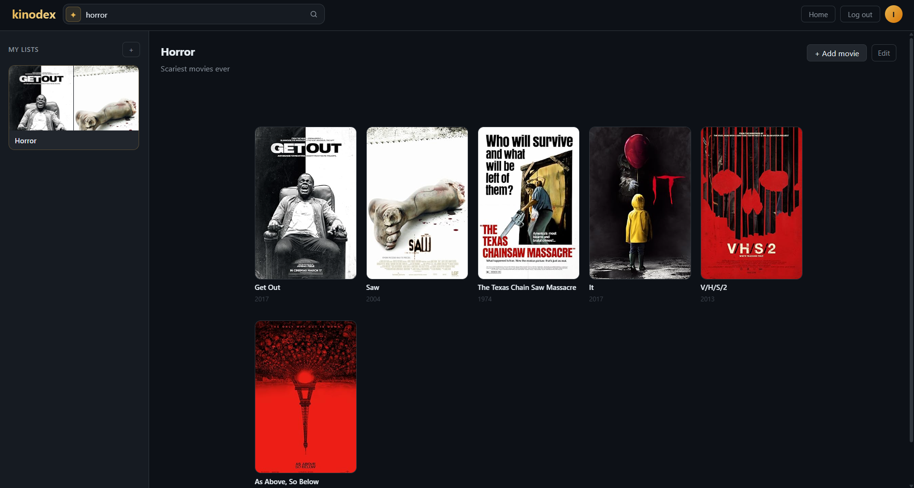
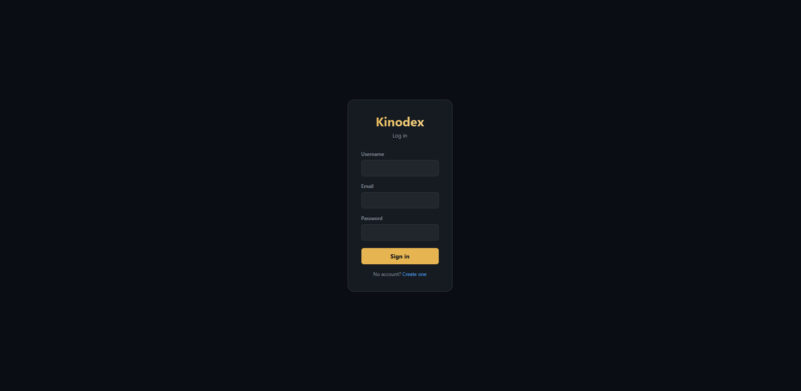

# KinoDex 🎬  
A personal movie recommender and list-sharing platform built with **React, Node.js, Express, PostgreSQL, and JWT authentication**.  

---

## 📸 Screenshots  
*(Add 2–3 images here — GitHub renders them inline if you use Markdown. Place them in a `/screenshots` folder in your repo or link externally.)*  

-   
-   
-   

> 👉 Tip: Include at least one **UI screenshot** (lists or dashboard), and one showing **interaction** (like adding/searching movies).  

---

## 🚀 Features  
- **User Authentication**: Secure login & signup with JWT.  
- **Personalized Lists**: Create, edit, and delete custom movie/series lists.  
- **Movie Search**: Search movies via OMDb API and add them to your lists.  
- **List Management**: View, update, and organize saved items easily.  
- **Responsive Frontend**: Built with React and CSS.  

---

## 🛠️ Tech Stack  
**Frontend:**  
- React  
- React Router  
- CSS  

**Backend:**  
- Node.js  
- Express.js  
- PostgreSQL (via `pg`)  
- JWT (JSON Web Tokens) for authentication  

**APIs & Tools:**  
- OMDb API for movie data  
- pgAdmin (for DB management)  

---

## 📌 Roadmap (In Progress)  
- ✅ Basic user authentication and list creation  
- 🚧 Add friends & view their lists  
- 🚧 Share lists with friends  
- 🚧 Media sharing and comments  
- 🚧 Voting on lists (👍 / 👎)  
- 🚧 Premium features (e.g., favorite actors)  

---

## ⚡ Getting Started  

### Requirements  
- Node.js (>= 18)  
- PostgreSQL (>= 14) running locally  
- OMDb API key  

### 1. Clone the repo  
```bash
git clone https://github.com/Iasonaschron/kinodex.git
cd kinodex
```

### 2. Backend (Server)  
```bash
cd server
cp .env.example .env   # fill in your DB and secret values
npm install
# create database manually (or via schema.sql if provided)
npm start
```

### 3. Frontend (Client)  
```bash
cd client
cp .env.example .env   # add OMDb API key
npm install
npm start
```

The client runs on `http://localhost:3000` and the backend on `http://localhost:3001`.  

---

## 🔒 Environment Variables  

**server/.env.example**  
```env
PGHOST=localhost
PGPORT=5432
PGDATABASE=kinodex
PGUSER=postgres
PGPASSWORD=yourpassword
JWT_SECRET=changeme
PORT=3001
```

**client/.env.example**  
```env
REACT_APP_OMDB_API_KEY=your_key_here
REACT_APP_API_BASE=http://localhost:3001
```

---

## 🗄️ Database Setup  
If you want others to replicate your DB schema:  

```bash
createdb kinodex
psql -d kinodex -f server/db/schema.sql
```

*(Make sure to include `server/db/schema.sql` in your repo for others.)*  

---

## 🤝 Contributing  
Pull requests are welcome. For major changes, please open an issue first to discuss what you’d like to change.  

---

## 📜 License  
This project is licensed under the MIT License.  
