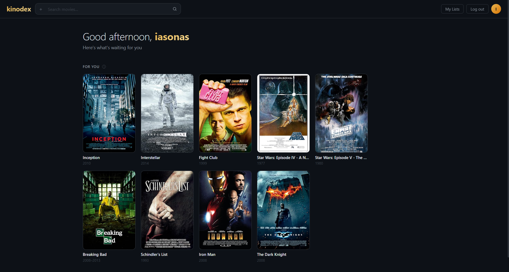
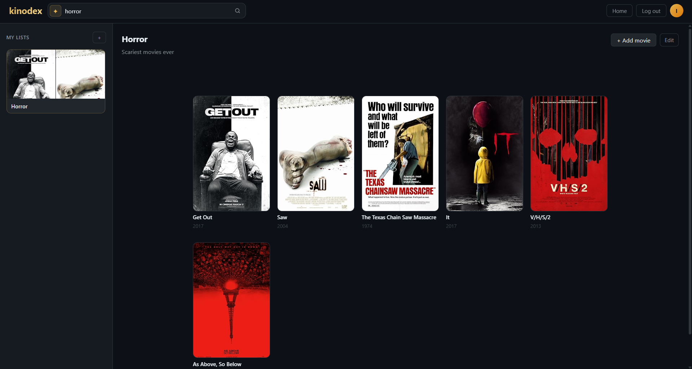
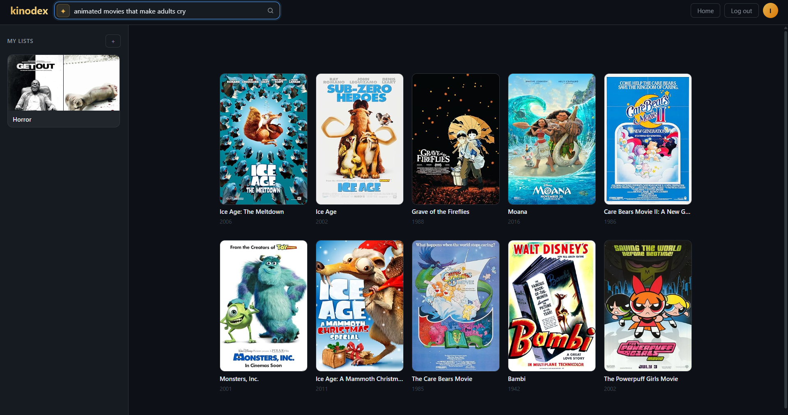
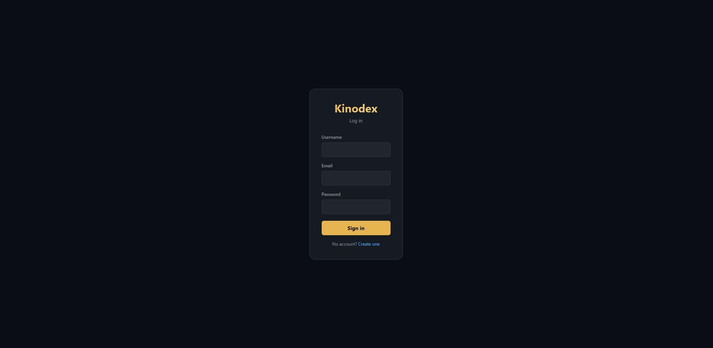

# Kinodex

A full-stack movie tracking and recommendation platform with two AI-powered features: **collaborative filtering** for personalised recommendations and **semantic/natural-language search** powered by a sentence-transformer model.

Built with **React · Node.js · Express · PostgreSQL · Python (sentence-transformers)**.

---

## Screenshots

**Home — personalised recommendations**


**List view — curate and manage your lists**


**Vibe Search — describe a mood, get results**


**Login**


---

## Features

### AI Personalised Recommendations (MinHash + LSH)
Every user's saved-movie set is hashed into a MinHash signature. LSH banding efficiently clusters users by taste similarity, and unseen movies from similar users are surfaced as **"For You"** recommendations — no external recommendation API, built from scratch.

### AI Semantic / Vibe Search
A Python microservice embeds the full MovieLens dataset (~9,000 movies) using a pre-trained transformer model (`all-MiniLM-L6-v2` via `sentence-transformers`). At query time the search phrase is embedded into the same vector space and matched against the movie corpus via cosine similarity — so you can search *"psychological thriller with an unreliable narrator"* or *"animated movie that makes adults cry"* instead of a title. The ✦ toggle in the search bar switches between keyword and AI search modes.

### Movie Lists
Create named lists with descriptions, add movies via inline search, edit or delete entries in a dedicated edit mode, and browse poster thumbnail previews across the app.

### Auth
JWT-based authentication with protected API routes. Passwords hashed with bcrypt.

---

## Tech Stack

| Layer | Stack |
|---|---|
| Frontend | React, React Router, CSS (custom design system) |
| Backend | Node.js, Express |
| Database | PostgreSQL |
| Auth | JWT + bcrypt |
| AI Recommendations | MinHash + LSH collaborative filtering (implemented from scratch) |
| AI Semantic Search | Python, Flask, sentence-transformers (transformer embeddings + cosine similarity) |
| Movie Data | OMDb API |

---

## Getting Started

### With Docker (recommended)

The entire stack — Postgres, Node API, Python semantic service, and React frontend — runs with one command. No local installs needed beyond Docker itself.

```bash
git clone https://github.com/Iasonaschron/kinodex.git
cd kinodex
docker compose up --build
```

Then open **http://localhost:3000**.

> **First boot takes a few minutes.** The semantic service downloads the MovieLens dataset and builds embeddings on startup. Subsequent starts load from cache and are fast. The database comes pre-seeded with data so recommendations work immediately.

---

### Manual setup (without Docker)

#### Requirements
- Node.js >= 18
- PostgreSQL >= 14
- Python >= 3.9 (for vibe search only)

#### 1. Clone
```bash
git clone https://github.com/Iasonaschron/kinodex.git
cd kinodex
```

#### 2. Database
```bash
createdb kinodex
psql -d kinodex -f server/db/schema.sql
```

#### 3. Backend
```bash
cd server
npm install
npm start              # runs on port 3001
```

Set these in `server/.env`:
```env
PGHOST=localhost
PGPORT=5432
PGDATABASE=kinodex
PGUSER=postgres
PGPASSWORD=yourpassword
JWT_SECRET=changeme
PORT=3001
SEMANTIC_SERVICE_URL=http://localhost:5001
```

#### 4. Frontend
```bash
cd client
npm install
npm start              # runs on port 3000
```

#### 5. Vibe Search (optional)
```bash
cd server/semantic
python -m venv .venv
source .venv/bin/activate   # Windows: .venv\Scripts\activate
pip install -r requirements.txt
python service.py
```
First run downloads the MovieLens dataset and builds embeddings (~1–2 min). Results are cached so subsequent starts take ~2 seconds.

---

## Environment Variables

**`server/.env`**
```env
PGHOST=localhost
PGPORT=5432
PGDATABASE=kinodex
PGUSER=postgres
PGPASSWORD=yourpassword
JWT_SECRET=changeme
PORT=3001
SEMANTIC_SERVICE_URL=http://localhost:5001
```

**`client/.env`**
```env
REACT_APP_API_BASE=http://localhost:3001
```
